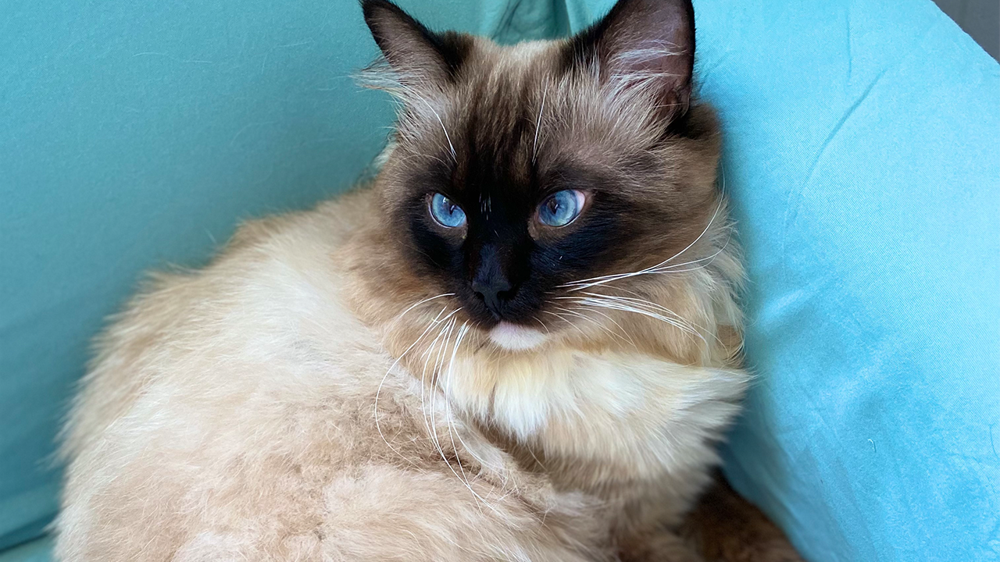

# 解决hexo 本地图片无法显示问题

**1.问题定义**: 利用hexo 搭建静态博客，页面无法显示本地图片（如果图片网络地址来自网络可以正确显示）

**2.问题解决**: 本地图片相对地址编译过程不能正确匹配网络端地址

**3.解决过程演示**
hexo + icarus theme 搭建静态博客 本地图片 **source/_posts/img/tt.jpeg** 在页面中显示
我们采用tt.jpeg **img/tt.jpeg** 相对路径在markdown中如下

```bash
<div class="justified-gallery">



</div>
```

<div class="justified-gallery">


</div>


尽管路径正确，但是我们发现本地tt.jpeg图片在页面无法显示
经过分析我们用命令
```
$ hexo g
```
在产生的public文件中寻找编译后路径发现如下

```bash
<div class="justified-gallery">

<p></p>

</div>
```
推到网页端
```bash
$ hexo d
```
我们发现在网页端本地**tt.jpeg**图片显示路径为
> https://elementsix.github.io/2022/05/15/solving-hexo-icarus-theme-local-image-display-erro/tt.jpeg

问题找到,我们在引用本地图片时图片地址经过编译会出现位置不匹配，所以我们必须改变markdown地址应用，更改如下

```bash

<div class="justified-gallery">


</div>

```
<div class="justified-gallery">


</div>

此时本地图片**tt.jpeg**显示正确

> **问题总结：hexo 本地图片显示正常1.首先图片与markdown文件要位于同一目录下 2.其次图片引用路径要匹配网页端显示地址